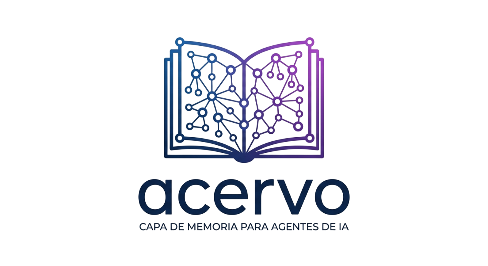

<p align="center">
  
  <br/>
  <strong>Semantic compression layer for AI agents.</strong><br/>Your agent's context window is finite. Acervo makes it infinite.
</p>

<p align="center">
  <a href="https://pypi.org/project/acervo/"></a>
  <a href="https://github.com/sandyeveliz/acervo/blob/main/LICENSE"></a>
  
  <a href="https://sandyeveliz.github.io/acervo"></a>
</p>

---

## The problem

Every chat application sends the **entire conversation history** to the LLM on every turn. Turn 1 costs 200 tokens. Turn 50 costs 9,000. Turn 100 hits the context window limit and starts losing information.

And it's getting worse. Custom rules (CLAUDE.md), skills, agent instructions, MCP tool definitions — each layer adds more static tokens to every request. The models now support 128K–1M token contexts, but having more space doesn't solve the problem. You're stuffing everything into a bigger bag instead of organizing what you need.

RAG helps, but it's brute force — it searches everything, retrieves long text chunks, and floods the context with tokens that are mostly noise. A 5-chunk retrieval at 500 tokens each costs 2,500 tokens per turn, and most of that text isn't relevant to the current question.

**And then there's the session problem.** Close the conversation, open a new one — everything is gone. You start from scratch every time.

## What Acervo does differently

Acervo builds a **knowledge graph** from every conversation. When a new message arrives, it retrieves only the relevant context — not raw text chunks, but **compressed knowledge nodes**. The graph *is* the summary.

```
Without Acervo:   turn 1 → 200tk  │  turn 50 → 9,000tk  │  turn 100 → context limit
Classic RAG:      turn 1 → 200tk  │  turn 50 → 2,500tk  │  turn 100 → 2,500tk (noisy)
With Acervo:      turn 1 → 200tk  │  turn 50 → ~400tk   │  turn 100 → ~400tk (signal)
```

A question like "What tech does Project Alpha use?" doesn't need 2,500 tokens of retrieved paragraphs. It needs the compressed knowledge:

```
Project Alpha: web app, e-commerce platform
  → uses: React, PostgreSQL, Redis
  → maintained by: Alice, Bob
  → deployed on: AWS, web + mobile
```

Pure signal, zero noise. And when you close the session and come back tomorrow, the graph is still there. **No more starting from scratch.**

## How it works

Acervo is a **context proxy** — it sits between your app and the LLM. Transparent, stateless, zero code changes required.

```
User message
     │
     ▼
 S1 Unified        ← Topic detection + knowledge extraction (one LLM call)
     │
     ▼
 Context build     ← Reads the graph, assembles compressed context from relevant nodes
     │
     ▼
 Your LLM          ← Responds with enriched context (you control model, streaming, tools)
     │
     ▼
 S1.5 Graph Update ← Async: extracts from response, curates graph, merges duplicates
     │
     ▼
 Graph grows       ← Next turn has more knowledge available, still constant tokens
```

### The pipeline

**S1 Unified** (sync, before response) — Classifies the topic and extracts entities, relations, and facts from the user's message. One LLM call replaces what used to be three separate steps.

**S1.5 Graph Update** (async, after response) — Runs in the background without blocking the user. Extracts knowledge from the assistant's response, merges duplicate nodes, corrects types, and creates missing relations. This is what makes Acervo **stateless** — the graph is always up to date and ready for the next message, whenever it comes.

### Stateless by design

Acervo has no session state. The graph **is** the state. Every turn follows the same pipeline: read from graph → compress → inject → extract → write. If your app crashes and restarts, if you close the session and come back next week — the next message works identically. The graph remembers.

## Quick start

### 1. Install

```bash
pip install acervo
```

### 2. Start a local LLM

Acervo works best with our fine-tuned extraction model. Load it in LM Studio or Ollama:

**With [LM Studio](https://lmstudio.ai/):**
Search for `acervo-extractor-qwen3.5-9b` and load it. One model handles everything — chat and extraction.

**With [Ollama](https://ollama.ai/):**
```bash
ollama run sandyeveliz/acervo-extractor
```

Any OpenAI-compatible model also works as a fallback (e.g., `qwen2.5:3b`, `gpt-4o-mini`).

### 3. Initialize and run

```bash
cd your-project
acervo init          # Creates .acervo/ directory
acervo serve         # Starts proxy on port 9470
```

Point your app's `base_url` to `http://localhost:9470` — that's it. Acervo intercepts every request, enriches it with graph context, and forwards it to your LLM.

### 4. Or use as a library

```python
import asyncio
from acervo import Acervo, OpenAIClient

async def main():
    llm = OpenAIClient(
        base_url="http://localhost:1234/v1",
        model="acervo-extractor-qwen3.5-9b",
    )
    memory = Acervo(llm=llm, owner="demo-user")

    history = [{"role": "system", "content": "You are a helpful assistant."}]

    # Turn 1: user shares information
    user_msg = "I work at Acme Corp, we're building a React app called Beacon with PostgreSQL"
    history.append({"role": "user", "content": user_msg})

    prep = await memory.prepare(user_msg, history)
    # Call YOUR LLM with prep.context_stack
    assistant_msg = "Got it! Tell me more about Beacon."
    history.append({"role": "assistant", "content": assistant_msg})

    await memory.process(user_msg, assistant_msg)
    # Graph now has: Acme Corp (organization), Beacon (project), React + PostgreSQL (technology)

    # Turn 2: ask about something stored
    user_msg = "What do you know about our project?"
    history.append({"role": "user", "content": user_msg})

    prep = await memory.prepare(user_msg, history)
    # prep.has_context → True
    # Context includes Beacon's full node — not the raw turn 1 text

asyncio.run(main())
```

## Proxy mode (`acervo serve`)

The recommended way to use Acervo. Zero code changes — just redirect your app's `base_url`.

```bash
acervo serve --port 9470 --forward-to http://localhost:1234/v1
```

```
Your app                    Acervo proxy (:9470)                LLM server (:1234)
   │                              │                                   │
   ├─ POST /v1/chat/completions ─►│                                   │
   │                              ├─ S1: topic + extraction           │
   │                              ├─ inject compressed context         │
   │                              ├─ POST /v1/chat/completions ──────►│
   │                              │◄──────────── stream response ─────┤
   │◄──── stream response ────────┤                                   │
   │                              ├─ S1.5: async graph curation       │
   │                              │                                   │
```

Supports OpenAI (`/v1/chat/completions`) and Anthropic (`/v1/messages`) formats, streaming and non-streaming.

```bash
curl http://localhost:9470/acervo/last-turn    # What Acervo did on the last turn
curl http://localhost:9470/acervo/status        # Graph stats
```

## Data storage

All data lives in `.acervo/` in your project directory, following the `.git/` pattern:

```
your-project/
├── .acervo/
│   ├── graph/
│   │   ├── nodes.json
│   │   └── edges.json
│   ├── vectordb/
│   └── config.toml
├── src/
└── ...
```

```bash
acervo init      # Create .acervo/ directory
acervo status    # Show graph stats
acervo reset     # Clear all data (graph + vector store)
```

## The knowledge graph

As conversations happen, Acervo builds a persistent graph of entities, relations, and facts. Every node is a compressed representation — not raw text, but structured knowledge.

### What gets extracted

**Entities** — real, named things with 8 types:

```
person, organization, project, technology, place, event, document, concept
```

**Relations** — 15 precise connection types:

```
part_of, created_by, maintains, works_at, member_of,
uses_technology, depends_on, alternative_to,
located_in, deployed_on, produces, serves, documented_in,
participated_in, triggered_by, resulted_in
```

**Facts** — specific claims attached to entities:

```
Project Beacon: "In production since March, 50k monthly users"
Alice Chen: "Lead developer, joined in 2024"
```

### Two knowledge layers

**PERSONAL** — User-specific: projects, preferences, relationships. Scoped to that user.

**UNIVERSAL** — World knowledge: technologies, cities, public figures. Shareable across users.

The extractor assigns layers automatically. "We use React" creates a PERSONAL edge from your project to the UNIVERSAL React node.

### Events as super-summaries

Instead of storing 5,000 tokens of meeting notes:

```
Event: "Sprint review Q1"
  participants: [Alice, Bob, CTO]
  description: "Shipped auth module, discussed perf issues, decided to add Redis cache"
  temporal_marker: "End of Q1 2026"
```

The LLM gets ~40 tokens instead of the full transcript.

## Topic-based context layers

What makes Acervo fundamentally different from a cache or a RAG system.

### The layers move with the conversation

Traditional systems use temporal layers — recent = hot, old = cold. Acervo uses **topic-based layers**: what's relevant depends on what you're talking about *right now*.

```
09:00 — "Let's work on the auth bug in Beacon"
  HOT:  Beacon, React, PostgreSQL, auth module, Alice
  → LLM receives ~200 tokens of graph context

09:45 — "Now let's look at Project Compass, the mobile app"
  HOT:  Compass, React Native, Firebase
  WARM: Beacon, React, auth module          ← dropped from hot
  → LLM receives ~200 tokens about Compass only

14:00 — "Back to the Beacon auth bug, did we fix it?"
  HOT:  Beacon, React, auth module          ← jumps back to hot instantly
  → LLM receives Beacon context including this morning's facts

17:00 — "Switching gears — have you read Dune?"
  HOT:  Dune, Arrakis, Paul Atreides       ← completely new cluster
  COLD: ALL work context (0 tokens)
```

### Progressive retrieval

1. **Default**: inject only hot layer (~200-400 tokens)
2. **If user asks for more**: bring in warm layer
3. **If needed**: bring in cold layer

In 80% of turns, hot is enough.

## Fine-tuned extraction model

Acervo includes a fine-tuned model specifically trained for knowledge graph extraction:

**[acervo-extractor-qwen3.5-9b](https://huggingface.co/SandyVeliz/acervo-extractor-qwen3.5-9b)** — Based on Qwen 3.5 9B, trained on 612 examples across 5 domains.

| Metric | Score |
|--------|-------|
| JSON parse rate | 100% |
| Extraction accuracy | 85% |
| Languages | English + Spanish |

**Single model architecture** — The same model handles both chat and extraction. The system prompt determines behavior. No need for separate models. ~6GB VRAM total.

Training data, notebooks, and evaluation scripts are in the [acervo-models](https://github.com/sandyeveliz/acervo-models) repository.

## Index a codebase

Acervo can index an entire project directory — parsing source code with tree-sitter, resolving import dependencies, and building a structural knowledge graph without any LLM calls.

```bash
acervo init /path/to/project
acervo index /path/to/project
```

For a 50-file project, structural indexing takes **under 2 seconds**. Each file stores a SHA-256 hash — unchanged files are skipped on re-index.

### What it extracts

**Phase 1 — Structural** (tree-sitter, no LLM): functions, classes, interfaces, imports/exports, markdown sections.

**Phase 2 — Semantic** (optional): embeddings per entity, LLM summaries, topic tags.

```bash
acervo index /path/to/project \
  --embedding-model nomic-embed-text \
  --embedding-endpoint http://localhost:11434
```

### Supported files

| Extension | Parser | Extracts |
|-----------|--------|----------|
| `.py` | tree-sitter | functions, classes, methods, imports, decorators |
| `.ts` `.tsx` | tree-sitter | functions, classes, interfaces, types, imports, exports |
| `.js` `.jsx` | tree-sitter | functions, classes, imports, exports |
| `.html` | regex | component references, element IDs |
| `.css` | regex | selectors, custom properties |
| `.md` | heading parser | sections with hierarchy context |

## Architecture

### How nodes replace chunks

Traditional RAG: "When did Alice and Bob first work together?" → 5 chunks × 500 tokens = 2,500 tokens.

Acervo:

```
Alice → participated_in → Project Beacon launch (event)
Bob   → participated_in → Project Beacon launch (event)

Event: "Project Beacon launch"
  description: "First joint project, shipped MVP in 2 weeks"
  temporal_marker: "March 2025"
```

~60 tokens. Same answer quality.

### Pipeline components

| Component | What it does |
|-----------|-------------|
| **S1 Unified** | Topic classification + entity/relation/fact extraction in one call |
| **S1.5 Graph Update** | Async graph curation: merges, type corrections, assistant extraction |
| **Context index** | Selects hot/warm/cold nodes, assembles compressed context |
| **Topic detector** | Cascade: keywords → embeddings → LLM (most resolved without LLM) |

### History windowing

```
Traditional (turn 50):  system + msg1 + ... + msg50 = 9,000 tokens (growing)
Acervo (turn 50):       system + [graph context] + msg49 + msg50 = ~400 tokens (constant)
```

### Works with any LLM

```python
class LLMClient(Protocol):
    async def chat(
        self,
        messages: list[dict[str, str]],
        *,
        temperature: float = 0.0,
        max_tokens: int = 500,
    ) -> str: ...
```

## Tested setup

| Component | Tool | Model |
|-----------|------|-------|
| **LLM + Extraction** | [LM Studio](https://lmstudio.ai/) | `acervo-extractor-qwen3.5-9b` (single model for everything) |
| **Embeddings** | [Ollama](https://ollama.ai/) | `qwen3-embedding` (optional) |
| **Client app** | [AVS-Agents](https://github.com/sandyeveliz/AVS-Agents) | Python Web UI |

**VRAM requirement:** ~6GB (one model handles chat + extraction)

## Project status

v0.2.0 — [Changelog](./CHANGELOG.md)

| Feature | Status |
|---------|--------|
| Knowledge graph (JSON persistence) | ✅ Working |
| UNIVERSAL / PERSONAL layers | ✅ Working |
| `prepare()` / `process()` context proxy API | ✅ Working |
| S1 Unified extraction (topic + entities in one call) | ✅ Working |
| S1.5 Async graph curation (merges, corrections) | ✅ Working |
| Fine-tuned extraction model (Qwen 3.5 9B) | ✅ Published |
| Single model architecture (chat + extraction) | ✅ Working |
| Topic-based context layers (HOT/WARM/COLD) | ✅ Working |
| Topic detector (keywords → embeddings → LLM) | ✅ Working |
| Context index with token budgeting | ✅ Working |
| History windowing (constant token usage) | ✅ Working |
| Entity + relation + event extraction | ✅ Working |
| `.acervo/` project data directory | ✅ Working |
| `acervo index` — structural + semantic | ✅ Working |
| REST API (`acervo serve`) | ✅ Working |
| Reproducible benchmarks (100-turn comparison) | 🔜 v0.3 |
| Progressive retrieval (hot → warm → cold) | 🔜 v0.3 |
| Docker Compose (one-command setup) | 🔜 v0.3 |
| Interactive demo (GitHub Pages) | 🔜 v0.3 |
| Graph → Vector DB chunk refs | 🔜 v0.4 |

## Documentation

- **[Tutorial](https://sandyeveliz.github.io/acervo/tutorial/)** — Build a chat with persistent memory in 5 minutes
- **[Getting Started](https://sandyeveliz.github.io/acervo/getting-started/)** — Installation, quick start, LLMClient protocol
- **[Configuration](https://sandyeveliz.github.io/acervo/configuration/)** — SDK parameters, environment variables
- **[Knowledge Layers](https://sandyeveliz.github.io/acervo/layers/)** — UNIVERSAL vs PERSONAL, node lifecycle, topic layers
- **[Roadmap](https://sandyeveliz.github.io/acervo/roadmap/)** — Planned features
- **[Blog series](https://sandyeveliz.github.io/acervo/blog/)** — Development journey, version by version

## Why "Acervo"?

In library science, an *acervo* is the complete collection of a library — every book, document, and record, organized so anything can be found when needed.

Your agent's memory should work like a library: knowledge organized by subject, retrievable in an instant. Not like someone who reads every book from cover to cover every time you ask a question.

## Contributing

Open source under Apache 2.0. See [CONTRIBUTING.md](./CONTRIBUTING.md).

## License

Apache 2.0 — see [LICENSE](./LICENSE).

---

<p align="center">
  <a href="https://github.com/sandyeveliz/acervo">GitHub</a> · <a href="https://sandyeveliz.github.io/acervo">Docs</a> · <a href="https://pypi.org/project/acervo/">PyPI</a> · <a href="https://huggingface.co/SandyVeliz/acervo-extractor-qwen3.5-9b">Model</a>
</p>