<p align="center">
  <h1 align="center">acervo</h1>
  <p align="center"><strong>Context proxy for AI agents.</strong><br/>Enriches context before. Extracts knowledge after. Remembers everything.</p>
</p>

<p align="center">
  <a href="https://pypi.org/project/acervo/"></a>
  <a href="https://github.com/sandyeveliz/acervo/blob/main/LICENSE"></a>
  
  <a href="https://sandyeveliz.github.io/acervo"></a>
</p>

---

Every conversation your AI agent has starts from scratch. Every context is forgotten. Your agent asks the same questions, loses the same insights, and has no idea who it's talking to.

Acervo fixes that. It sits between the user and the LLM as a **context proxy** — building a knowledge graph that grows with every conversation, and assembling only the relevant context before each LLM call.

## How it works

```mermaid
flowchart LR
    A["User message"] --> B["acervo.prepare()"]
    B --> B1["Topic Detector"]
    B1 --> B2["Query Planner\n(LLM)"]
    B2 --> B3["Context Index"]
    B3 --> C["context_stack\n+ plan"]
    C --> D["Your app\ncalls LLM"]
    D --> E["acervo.process()"]
    E --> E1["Extractor\n(LLM)"]
    E1 --> E2["Graph persist"]

    style B fill:#2d5016,stroke:#4a8c1c
    style E fill:#2d5016,stroke:#4a8c1c
    style D fill:#1a3a5c,stroke:#3a7abd
```



Acervo does **not** call the LLM itself. Your app controls the model, streaming, and tools. Acervo only enriches context and extracts knowledge.

## The knowledge graph

As conversations happen, Acervo builds a persistent graph of entities, relations, and facts:

```mermaid
graph TD
    sandy["Sandy\n(Persona)"]
    avs["Altovallestudio\n(Organizacion)"]
    cipo["Cipolletti\n(Lugar)"]
    rn["Rio Negro\n(Lugar)"]
    butaco["Butaco\n(Proyecto)"]
    angular["Angular\n(Tecnologia)"]
    batman["Batman\n(Personaje)"]
    dc["DC Universe\n(Universo)"]

    sandy -->|TRABAJA_EN| avs
    sandy -->|VIVE_EN| cipo
    cipo -->|ubicado_en| rn
    sandy -->|DUEÑO_DE| butaco
    butaco -->|USA_TECNOLOGIA| angular
    batman -->|PART_OF| dc

    classDef personal fill:#3a1f5c,stroke:#7c3aed
    classDef universal fill:#1a3a5c,stroke:#3a7abd
    class sandy,avs,butaco personal
    class cipo,rn,angular,batman,dc universal
```



<sup>Purple = PERSONAL (user-specific) · Blue = UNIVERSAL (world knowledge)</sup>

## Installation

```bash
pip install acervo
```

Or install from source:

```bash
git clone https://github.com/sandyeveliz/acervo.git
cd acervo
pip install -e .
```

### Requirements

- Python 3.11+
- An OpenAI-compatible LLM server (LM Studio, Ollama, OpenAI, etc.)

## Quick start

### 1. Start your LLM server

Acervo needs a small utility model for extraction, planning, and topic detection. Any OpenAI-compatible endpoint works.

**With [LM Studio](https://lmstudio.ai/):** Load `qwen2.5-3b-instruct` (or any 3B+ model) and start the server on port 1234.

**With [Ollama](https://ollama.ai/):**
```bash
ollama run qwen2.5:3b
```

### 2. Use the prepare/process API

```python
import asyncio
from acervo import Acervo, OpenAIClient

async def main():
    # Connect to your LLM (any OpenAI-compatible endpoint)
    llm = OpenAIClient(
        base_url="http://localhost:1234/v1",
        model="qwen2.5-3b-instruct",
        api_key="lm-studio",
    )

    memory = Acervo(llm=llm, owner="Sandy")
    history = [{"role": "system", "content": "You are a helpful assistant."}]

    # --- Turn 1: user tells the agent something ---
    user_msg = "I work at Altovallestudio, we build software"
    history.append({"role": "user", "content": user_msg})

    # Acervo prepares context from graph
    prep = await memory.prepare(user_msg, history)
    # prep.context_stack → messages with injected graph context
    # prep.has_context → False (first time, nothing in graph yet)

    # Your app calls the LLM (use your own client, streaming, etc.)
    assistant_msg = "Nice! Tell me more about your projects."
    history.append({"role": "assistant", "content": assistant_msg})

    # Acervo extracts knowledge from the conversation
    await memory.process(user_msg, assistant_msg)
    # Graph now has: Altovallestudio (Organizacion), Sandy (Persona)

    # --- Turn 2: ask about something stored ---
    user_msg2 = "What do you know about my company?"
    history.append({"role": "user", "content": user_msg2})

    prep2 = await memory.prepare(user_msg2, history)
    # prep2.has_context → True!
    # prep2.context_stack includes graph data about Altovallestudio

    print("Context for LLM:", prep2.context_stack)

asyncio.run(main())
```

### 3. Use the low-level API

If you don't need the full pipeline (topic detection, planning), you can use `commit()` and `materialize()` directly:

```python
# Store knowledge
await memory.commit(
    "Batman was created by Bill Finger and Bob Kane in 1939",
    "He first appeared in Detective Comics #27.",
)

# Retrieve relevant context
context = memory.materialize("Batman")
# Returns: "# Batman (Personaje)\nEl usuario mencionó:\n- was created by Bill Finger..."
```

## Tested setup

This is the stack we use daily for development and testing:

| Component | Tool | Model |
|-----------|------|-------|
| **LLM server** | [LM Studio](https://lmstudio.ai/) | `unsloth/qwen3.5-9b` (chat) + `qwen2.5-3b-instruct` (utility) |
| **Embeddings** | [Ollama](https://ollama.ai/) | `qwen3-embedding` (optional, for topic detection L2) |
| **Client app** | [AVS-Agents](https://github.com/sandyeveliz/AVS-Agents) | Python TUI with Textual |

Acervo works with any OpenAI-compatible endpoint. The `LLMClient` protocol is simple:

```python
class LLMClient(Protocol):
    async def chat(
        self,
        messages: list[dict[str, str]],
        *,
        temperature: float = 0.0,
        max_tokens: int = 500,
    ) -> str: ...
```

## Features

### Knowledge graph with two layers

- **UNIVERSAL** — world knowledge (cities, characters, technologies). Shared across users.
- **PERSONAL** — user-specific context (projects, preferences). Trusted within that user's session.

### Auto-registering ontology

Built-in types: `Persona`, `Personaje`, `Organizacion`, `Lugar`, `Tecnologia`, `Obra`, `Universo`, `Editorial`

Built-in relations: `IS_A`, `CREATED_BY`, `ALIAS_OF`, `PART_OF`, `SET_IN`, `DEBUTED_IN`, `PUBLISHED_BY`

When the LLM extracts a type or relation that doesn't exist yet, Acervo registers it automatically. No code changes needed.

### Pipeline components

All behind a single `LLMClient` protocol — one small model handles everything:

| Component | What it does |
|-----------|-------------|
| **Topic detector** | 3-level cascade: keywords → embeddings → LLM classification |
| **Query planner** | LLM decides: use graph, search web, or respond directly |
| **Context index** | 3-layer stack (system + warm graph + hot messages) with token budgeting |
| **Extractor** | Entities, semantic relations, and facts from conversations and web results |
| **Synthesizer** | Renders graph nodes into compact text for context injection |

### Constant token usage

```
Without Acervo:   turn 1 → 200tk  |  turn 50 → 9000tk  |  turn 100 → limit
With Acervo:      turn 1 → 200tk  |  turn 50 → 400tk   |  turn 100 → 420tk
```

## Project status

v0.1.2 — [Changelog](./CHANGELOG.md)

| Feature | Status |
|---------|--------|
| Knowledge graph (JSON persistence) | Working |
| Two-layer architecture (UNIVERSAL / PERSONAL) | Working |
| prepare() / process() context proxy API | Working |
| Auto-registering ontology | Working |
| Semantic relations (IS_A, CREATED_BY, ALIAS_OF, etc.) | Working |
| Topic detector (keywords → embeddings → LLM) | Working |
| Query planner (GRAPH_ALL / WEB_SEARCH / READY) | Working |
| Context index with token budgeting | Working |
| Built-in OpenAIClient (zero external deps) | Working |
| LLMClient + Embedder protocols | Working |
| PyPI package (`pip install acervo`) | Working |
| Unit tests (56 passing) | Working |
| REST API (`acervo serve`) | [Planned](https://sandyeveliz.github.io/acervo/roadmap/) |
| MCP server | [Planned](https://sandyeveliz.github.io/acervo/roadmap/) |
| `acervo init` directory indexer | [Planned](https://sandyeveliz.github.io/acervo/roadmap/) |
| Community knowledge packs | [Planned](https://sandyeveliz.github.io/acervo/roadmap/) |
| Vector search | [Planned](https://sandyeveliz.github.io/acervo/roadmap/) |

## Documentation

- **[Tutorial](https://sandyeveliz.github.io/acervo/tutorial/)** — build a chat with persistent memory in 5 minutes
- **[Getting Started](https://sandyeveliz.github.io/acervo/getting-started/)** — installation, quickstart, LLMClient protocol
- **[Configuration](https://sandyeveliz.github.io/acervo/configuration/)** — SDK parameters, environment variables
- **[Knowledge Layers](https://sandyeveliz.github.io/acervo/layers/)** — UNIVERSAL vs PERSONAL, node lifecycle, ontology
- **[Roadmap](https://sandyeveliz.github.io/acervo/roadmap/)** — planned features and their status

## Why "Acervo"?

In library science, an *acervo* is the complete collection of a library — every book, document, and record it holds, organized so anything can be found when needed.

An agent's memory should work like a well-run library: knowledge organized by subject, filed in the right place, and retrieved by a librarian who knows exactly which shelf to go to — not by someone who reads every book from cover to cover every time you ask a question.

## Contributing

Acervo is open source under Apache 2.0. See [CONTRIBUTING.md](./CONTRIBUTING.md) to get started.

## License

Apache 2.0 — see [LICENSE](./LICENSE). Copyright 2026 Sandy Veliz.

---

Built by [Sandy Veliz](https://github.com/sandyeveliz) · [AltoValleStudio](https://altovallestudio.com)
