# Acervo

**Context proxy for AI agents.** Sits between the user and the LLM — enriches context before, extracts knowledge after.

---

Every conversation your AI agent has starts from scratch. Every context is forgotten. Your agent asks the same questions, loses the same insights, and has no idea who it's talking to.

Acervo fixes that — not by dumping everything into the context window, but by building a structured knowledge graph that knows what to retrieve, when to retrieve it, and how much it can trust what it knows.

---

## How it works

```mermaid
flowchart LR
    A["User message"] --> B["acervo.prepare()"]
    B --> B1["Topic Detector"]
    B1 --> B2["Query Planner\n(LLM)"]
    B2 --> B3["Context Index"]
    B3 --> C["context_stack\n+ plan"]
    C --> D["Your app\ncalls LLM"]
    D --> E["acervo.process()"]
    E --> E1["Extractor\n(LLM)"]
    E1 --> E2["Graph persist"]

    style B fill:#2d5016,stroke:#4a8c1c
    style E fill:#2d5016,stroke:#4a8c1c
    style D fill:#1a3a5c,stroke:#3a7abd
```



Acervo does **not** call the LLM itself. Your app controls the model, streaming, and tool execution. Acervo only enriches context and extracts knowledge.

---

## Quickstart

```python
from acervo import Acervo, OpenAIClient

llm = OpenAIClient(
    base_url="http://localhost:1234/v1",
    model="qwen2.5-3b-instruct",
    api_key="lm-studio",
)

memory = Acervo(llm=llm, owner="Sandy")

# Before LLM call — enrich context from graph
prep = await memory.prepare(user_text, history)

# After LLM call — extract knowledge from response
await memory.process(user_text, assistant_response)
```

See the [Tutorial](tutorial.md) for a full walkthrough with a running example.

---

## Project status

| Feature | Status |
|---------|--------|
| Knowledge graph (JSON persistence) | Working |
| Two-layer architecture (UNIVERSAL / PERSONAL) | Working |
| prepare() / process() context proxy API | Working |
| Auto-registering ontology | Working |
| Topic detector, query planner, context index | Working |
| PyPI package (`pip install acervo`) | Working |
| 56 unit tests | Passing |
| REST API / MCP server | [Planned](roadmap.md) |
| Vector search | [Planned](roadmap.md) |
| Community knowledge packs | [Planned](roadmap.md) |

---

## Why Acervo?

In library science, an *acervo* is the complete collection of a library — every book, document, and record it holds, organized so anything can be found when needed.

An agent's memory should work like a well-run library: knowledge organized by subject, filed in the right place, and retrieved by a librarian who knows exactly which shelf to go to.
