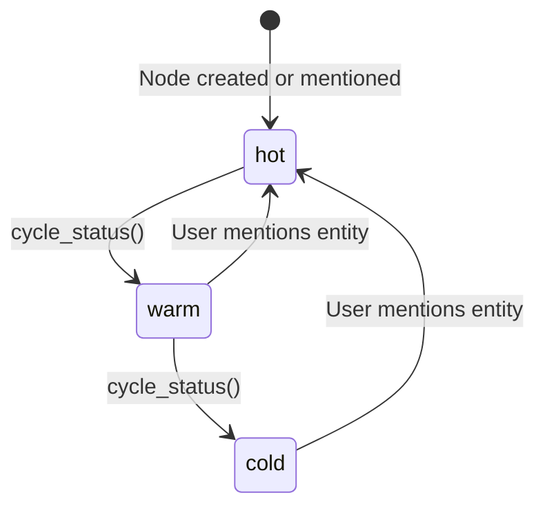

# Knowledge Layers

Acervo separates knowledge into two layers. This distinction is fundamental to how the memory graph works.

```mermaid
graph TD
    subgraph PERSONAL["PERSONAL layer (user-specific)"]
        sandy["Sandy (Persona)"]
        avs["Altovallestudio (Organizacion)"]
        butaco["Butaco (Proyecto)"]
    end
    subgraph UNIVERSAL["UNIVERSAL layer (world knowledge)"]
        cipo["Cipolletti (Lugar)"]
        rn["Rio Negro (Lugar)"]
        angular["Angular (Tecnologia)"]
    end

    sandy -->|TRABAJA_EN| avs
    sandy -->|VIVE_EN| cipo
    cipo -->|ubicado_en| rn
    sandy -->|DUEÑO_DE| butaco
    butaco -->|USA_TECNOLOGIA| angular

    classDef personal fill:#3a1f5c,stroke:#7c3aed
    classDef universal fill:#1a3a5c,stroke:#3a7abd
    class sandy,avs,butaco personal
    class cipo,rn,angular universal
```



<sup>Purple = PERSONAL · Blue = UNIVERSAL · Edges can cross layers</sup>

---

## Layer 1 — Universal (UNIVERSAL)

Verifiable world knowledge. Cities, countries, programming languages, frameworks, historical facts.

- **Source:** `"world"` — externally verifiable
- **Immutable:** once verified, it doesn't change per user
- **Examples:** "Cipolletti is in Rio Negro", "React is a JavaScript framework"

```python
from acervo import TopicGraph
from acervo.layers import Layer

graph = TopicGraph()

# A universal fact — anyone can verify this
graph.upsert_entities(
    entities=[("Cipolletti", "Lugar"), ("Rio Negro", "Lugar")],
    relations=[("Cipolletti", "Rio Negro", "ubicado_en")],
    facts=[("Cipolletti", "Ciudad en la provincia de Rio Negro, Argentina", "world")],
    layer=Layer.UNIVERSAL,
    source="world",
)
```

### Node structure (Layer 1)

```json
{
  "id": "cipolletti",
  "label": "Cipolletti",
  "type": "Lugar",
  "layer": "UNIVERSAL",
  "source": "world",
  "confidence_for_owner": 1.0,
  "status": "complete",
  "pending_fields": [],
  "facts": [
    {
      "fact": "Ciudad en la provincia de Rio Negro, Argentina",
      "source": "world"
    }
  ]
}
```

!!! info "Planned: Community knowledge packs"
    Pre-built UNIVERSAL layer graphs for specific domains (programming languages,
    geography, etc.) are planned for a future release. These will be installable
    and shareable. See [Roadmap](roadmap.md).

---

## Layer 2 — Personal (PERSONAL)

User-specific context. Projects, teams, preferences, work history. Things the user tells the agent about themselves.

- **Source:** `"user_assertion"` — the user said so
- **Not shareable:** belongs to one user's context
- **Mutable:** the user can correct or update facts
- **Trusted within context:** treated as ground truth for that user, like a new employee trusting what their manager says
- **Examples:** "Sandy works at Altovallestudio", "Butaco uses Angular"

```python
from acervo import TopicGraph
from acervo.layers import Layer

graph = TopicGraph()

# A personal fact — Sandy says so, real for Sandy
graph.upsert_entities(
    entities=[("Sandy", "Persona"), ("Altovallestudio", "Organizacion")],
    relations=[("Sandy", "Altovallestudio", "TRABAJA_EN")],
    facts=[("Sandy", "Sandy es dueña de Altovallestudio", "user")],
    layer=Layer.PERSONAL,
    source="user_assertion",
    confidence=1.0,
)
```

### Node structure (Layer 2)

```json
{
  "id": "sandy",
  "label": "Sandy",
  "type": "Persona",
  "layer": "PERSONAL",
  "source": "user_assertion",
  "confidence_for_owner": 1.0,
  "status": "complete",
  "pending_fields": [],
  "facts": [
    {
      "fact": "Sandy es dueña de Altovallestudio",
      "source": "user"
    }
  ]
}
```

---

## Cross-layer links

Layers connect naturally through edges. Sandy's project (Layer 2) uses Angular (Layer 1). The agent understands both the personal context and the technical depth behind it.

```python
# Sandy's project (PERSONAL) uses Angular (UNIVERSAL)
graph.upsert_entities(
    entities=[("Butaco", "Proyecto")],
    facts=[("Butaco", "ERP para empresa cliente, usa Angular monorepo", "user")],
    layer=Layer.PERSONAL,
)

# The relation links across layers
graph.upsert_entities(
    entities=[("Angular", "Tecnologia")],
    relations=[("Butaco", "Angular", "USA_TECNOLOGIA")],
    layer=Layer.UNIVERSAL,
    source="world",
)
```

---

## Incomplete nodes

When the extractor encounters an entity it can't fully classify, it stores it as `incomplete` with a `pending_fields` list. The agent fills in the missing information naturally in future turns — without interrogating the user.

```json
{
  "id": "unknown_project",
  "label": "ProjectX",
  "type": "Desconocido",
  "status": "incomplete",
  "pending_fields": ["tipo"],
  "facts": []
}
```

Once the type is resolved, the node transitions to `"complete"`.

---

## Node status lifecycle

Each turn, node statuses cycle to age out context:



- **hot** — actively being discussed. Always included in materialized context.
- **warm** — recently active. Included only if mentioned in the current message.
- **cold** — inactive. Not included unless explicitly activated.

New or mentioned nodes are set to `"hot"`. Call `memory.cycle_status()` at the start of each turn to age them.

---

## Ontology

Acervo ships with built-in entity types and relations. The LLM can also create new ones on the fly.

### Built-in entity types

| Type | Attributes |
|------|-----------|
| Persona | nombre, edad, rol, relacion_con_owner |
| Personaje | nombre, universo, creador |
| Organizacion | nombre, tipo, industria, ubicacion |
| Proyecto | nombre, stack, scaffold, arquitectura, modulos, estado |
| Lugar | nombre, tipo, region, pais |
| Tecnologia | nombre, tipo, version |
| Obra | nombre, autor, fecha |
| Universo | nombre, editorial |
| Editorial | nombre, pais |
| Documento | nombre, tipo, path, contenido_resumen |
| Regla | descripcion, aplica_a, tecnologia, severity |

### Built-in relations

`IS_A`, `CREATED_BY`, `ALIAS_OF`, `PART_OF`, `SET_IN`, `DEBUTED_IN`, `PUBLISHED_BY`, `TRABAJA_EN`, `VIVE_EN`, `DUEÑO_DE`, `PERTENECE_A`, `USA_TECNOLOGIA`, `TIENE_MODULO`, `GUSTA_DE`, `FAMILIAR_DE`, `RELACIONADO_CON`

### Auto-registration

When the LLM extracts a type or relation that doesn't exist in the ontology, Acervo registers it automatically. For example, if the LLM returns `{"type": "Superhero"}`, Acervo creates a new `Superhero` type on the fly instead of mapping it to `Unknown`.

### Registering custom types manually

```python
from acervo.ontology import register_type, register_relation
from acervo.layers import Layer

# Add your own entity type
register_type(
    name="Recipe",
    attributes=["ingredients", "time", "difficulty"],
    layer_default=Layer.PERSONAL,
)

# Add your own relation
register_relation("COAUTHORED_WITH")
```
