# Tutorial: Build a chat with persistent memory in 5 minutes

This guide walks you through setting up Acervo with a local LLM and running a chat that remembers everything across sessions.

## Prerequisites

- Python 3.11 or higher
- [LM Studio](https://lmstudio.ai/) (free, runs LLMs locally)

## Step 1: Download a model

1. Open **LM Studio**
2. Search for `qwen2.5-3b-instruct` in the model browser
3. Download it (about 2GB)
4. Go to the **Local Server** tab
5. Load the model and click **Start Server**
6. The server starts at `http://localhost:1234/v1`

!!! tip "Why a 3B model?"
    Acervo uses a small utility model for entity extraction, topic detection, and query planning. A 3B parameter model is fast and cheap — it runs on most laptops. Your main chat model can be larger (7B, 13B, etc.) and run separately.

## Step 2: Install Acervo

```bash
pip install acervo
```

Or install from source:

```bash
git clone https://github.com/sandyeveliz/acervo.git
cd acervo
pip install -e .
```

## Step 3: Run the example

Save this as `chat.py` (or use `examples/chat.py` from the repo):

```python
import asyncio
from acervo import Acervo, OpenAIClient

async def main():
    llm = OpenAIClient(
        base_url="http://localhost:1234/v1",
        model="qwen2.5-3b-instruct",
        api_key="lm-studio",
    )

    memory = Acervo(llm=llm, owner="User")
    history = [{"role": "system", "content": "You are a helpful assistant."}]

    print("Acervo Chat (type 'quit' to exit)\n")
    while True:
        user_input = input("You: ").strip()
        if not user_input or user_input.lower() in ("quit", "exit", "q"):
            break

        history.append({"role": "user", "content": user_input})

        # Acervo enriches context from the knowledge graph
        prep = await memory.prepare(user_input, history)

        # Call the LLM with enriched context
        response = await llm.chat(prep.context_stack, temperature=0.7, max_tokens=500)
        print(f"AI: {response}\n")

        history.append({"role": "assistant", "content": response})

        # Acervo extracts knowledge from the response
        await memory.process(user_input, response)
        print(f"  [{memory.graph.node_count} nodes, {memory.graph.edge_count} edges]\n")

asyncio.run(main())
```

Run it:

```bash
python chat.py
```

## Step 4: Try it out

Tell the agent some facts:

```
You: My name is Sandy and I live in Cipolletti
AI: Nice to meet you, Sandy! What would you like to talk about?
  [2 nodes, 1 edges]

You: I work at Altovallestudio, we build software
AI: Interesting! What kind of projects does Altovallestudio work on?
  [3 nodes, 3 edges]
```

Now quit (`Ctrl+C` or type `quit`) and **restart the script**. The graph persists:

```
You: What do you know about me?
AI: You're Sandy, you live in Cipolletti and work at Altovallestudio.
  [3 nodes, 3 edges]
```

The knowledge survived the restart because Acervo stores it in `data/graph/nodes.json`.

## Step 5: Look at the graph

Open `data/graph/nodes.json` to see what Acervo extracted:

```json
[
  {
    "id": "sandy",
    "label": "Sandy",
    "type": "Persona",
    "layer": "PERSONAL",
    "owner": "User",
    "facts": [
      {"fact": "Sandy lives in Cipolletti", "source": "user"},
      {"fact": "Sandy works at Altovallestudio", "source": "user"}
    ]
  },
  {
    "id": "cipolletti",
    "label": "Cipolletti",
    "type": "Lugar",
    "layer": "UNIVERSAL",
    "facts": []
  }
]
```

And `data/graph/edges.json` for the relationships:

```json
[
  {"source": "sandy", "target": "cipolletti", "relation": "ubicado_en"},
  {"source": "sandy", "target": "altovallestudio", "relation": "TRABAJA_EN"}
]
```

## What's happening under the hood

Each turn, Acervo runs a 3-step pipeline:

```mermaid
flowchart LR
    subgraph prepare["acervo.prepare()"]
        TD["Topic\nDetector"] --> QP["Query\nPlanner"]
        QP --> CI["Context\nIndex"]
    end
    subgraph process["acervo.process()"]
        EX["Extractor"] --> GP["Graph\nPersist"]
    end

    UM["User\nmessage"] --> prepare
    prepare --> LLM["Your app\ncalls LLM"]
    LLM --> process
    process --> KG["Knowledge\ngraph grows"]

    style prepare fill:#2d5016,stroke:#4a8c1c
    style process fill:#2d5016,stroke:#4a8c1c
    style LLM fill:#1a3a5c,stroke:#3a7abd
```



1. **`prepare()`** — detects the topic, plans what data to retrieve, builds a context stack from the knowledge graph
2. **Your app calls the LLM** — with the enriched context
3. **`process()`** — extracts entities, relations, and facts from the response, persists them to the graph

### The context stack

The context that `prepare()` builds has a specific structure:

```mermaid
flowchart TD
    S["[system] Your app's system prompt\n(immutable, KV cached)"]
    W["[user] Warm context from graph\n(verified knowledge about the topic)"]
    A["[assistant] 'Entendido.'\n(acknowledgment)"]
    H["[user/assistant] Hot layer\n(last 2 turn pairs from history)"]
    U["[user] Current user message"]

    S --> W --> A --> H --> U

    style S fill:#1a3a5c,stroke:#3a7abd
    style W fill:#2d5016,stroke:#4a8c1c
    style A fill:#2d5016,stroke:#4a8c1c
    style H fill:#5c3a1a,stroke:#bd7a3a
    style U fill:#5c1a1a,stroke:#bd3a3a
```



- **System prompt** stays immutable (KV cache friendly)
- **Warm context** from the graph enters as a separate user message — always included when relevant
- **Hot layer** keeps only the last 2 turn pairs from conversation history
- Token usage stays flat: the graph grows, but the context window doesn't

## Next steps

- **[Configuration](configuration.md)** — customize context settings, token budgets, embedding thresholds
- **[Knowledge Layers](layers.md)** — understand UNIVERSAL vs PERSONAL layers
- **[Web Search example](https://github.com/sandyeveliz/acervo/blob/main/examples/web_search.py)** — add Brave Search for real-time data
